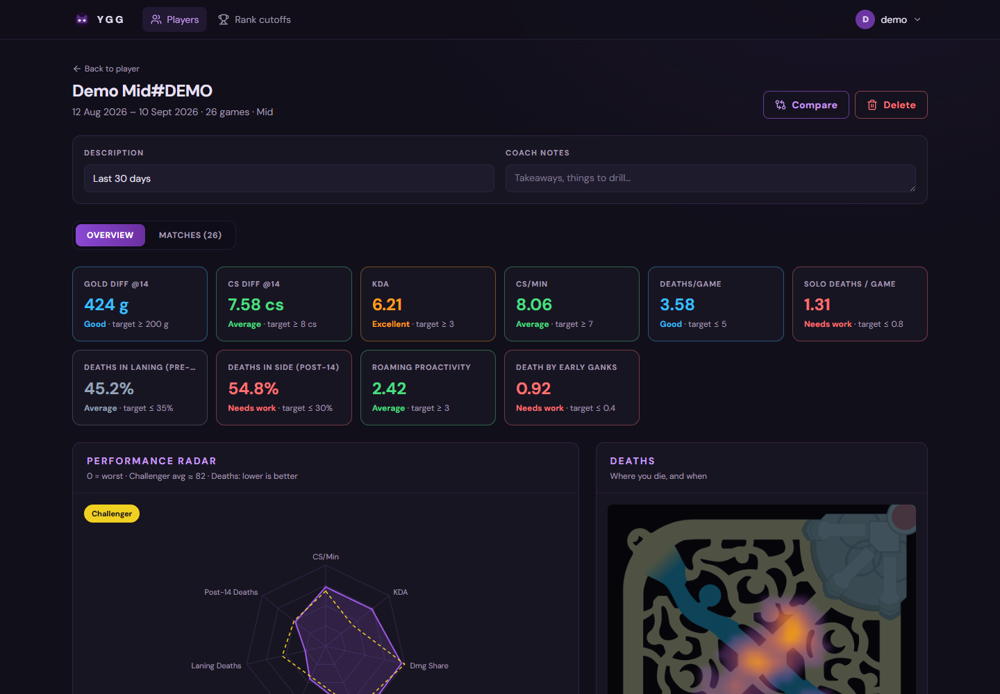
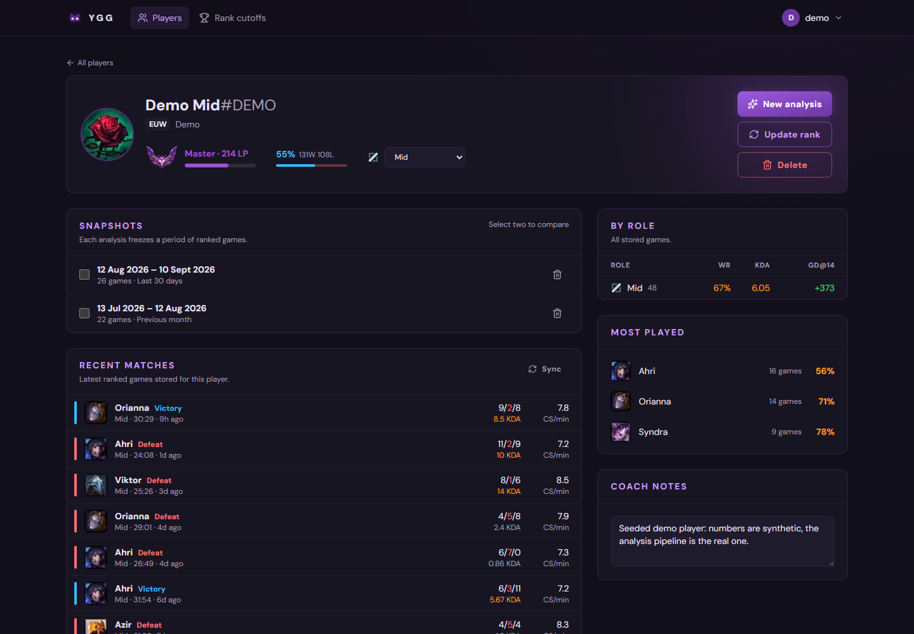
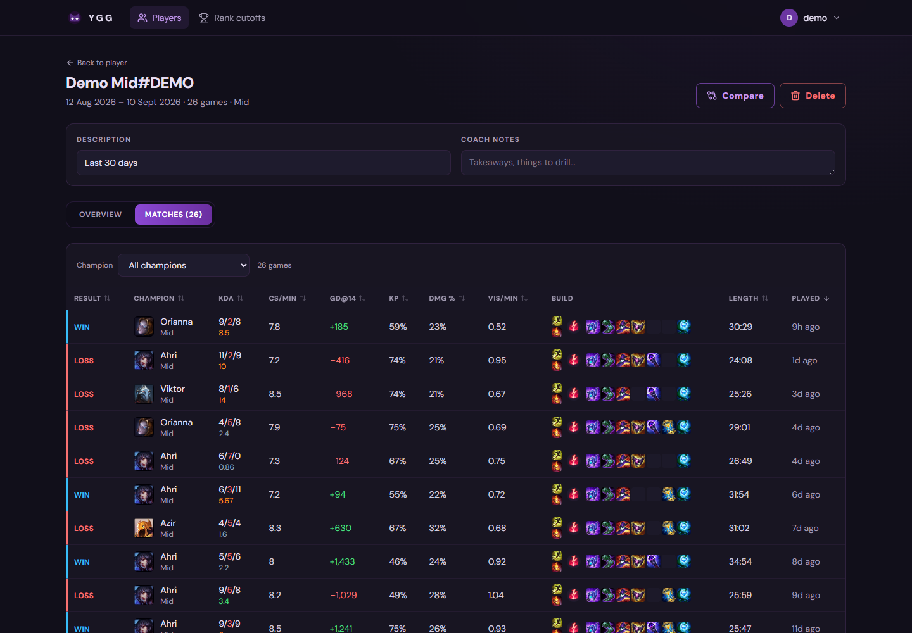
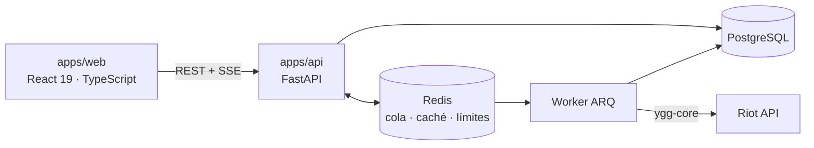

# YGG · Análisis de rendimiento en League of Legends

Plataforma de *scouting* que convierte las partidas clasificatorias de un jugador en las métricas que miraría
un entrenador: diferenciales de oro, CS y experiencia a lo largo de la partida, un radar normalizado por rol
comparado con cada rango, mapas de calor de dónde y cuándo muere, y la evolución entre dos períodos.



> **Demo pública:** pendiente de despliegue. La configuración está lista en [`docs/deploy.md`](docs/deploy.md);
> en local basta `docker compose` y el script de datos de demo (abajo).

## Para quién y qué hace

Pensado para entrenadores, analistas de equipos amateur y jugadores que quieren entender *por qué* ganan o
pierden, no solo su KDA.

- **Jugadores:** añade cuentas por Riot ID (se valida contra la API de Riot), con rango, progreso hacia el
  siguiente corte de LP, rol principal y notas.
- **Snapshots:** congela un período de partidas y analízalo. El trabajo corre en segundo plano y el progreso
  llega en directo.
- **Dashboard:** métricas del rol coloreadas por su estado (excelente, bien, normal, a mejorar), radar 0-100
  frente a las medias de cada rango o frente a otra cuenta, tendencias con media móvil, muertes por fase y
  mapa de calor sobre el minimapa, y tabla de partidas con build, runas y hechizos.
- **Comparación:** dos snapshots lado a lado, con qué métricas mejoraron y cuáles empeoraron.
- **Cortes de rango** de Grandmaster y Challenger por región, y **panel de administración**.

| Jugador | Partidas del snapshot |
|---|---|
|  |  |

## Arquitectura



- **`packages/ygg-core`**: motor de análisis en Python puro, sin FastAPI ni base de datos. Cliente de Riot con
  limitador global, enriquecimiento con timeline, métricas, almacén DuckDB y CLI.
- **`apps/api`**: FastAPI async con SQLAlchemy 2.0, autenticación con refresh tokens rotados, rate limiting,
  caché en Redis, worker ARQ y observabilidad (logs JSON, Prometheus, Sentry).
- **`apps/web`**: SPA en React con cliente HTTP generado desde el OpenAPI de la API, TanStack Query, Recharts y
  un mapa de calor en SVG propio.

Detalle en [`docs/architecture.md`](docs/architecture.md).

## Decisiones técnicas

| Decisión | Por qué |
|---|---|
| [Separar partida y participante](docs/adr/0001-partida-y-participante.md) | Con dos jugadores seguidos en la misma partida, uno heredaba las estadísticas del otro |
| [SQLAlchemy 2.0 async y SQL a mano](docs/adr/0002-sqlalchemy-2-y-sql-a-mano.md) | El ORM síncrono bloqueaba el event loop; la analítica se lee mejor (y se revisa con `EXPLAIN`) en SQL |
| [DuckDB en el core](docs/adr/0003-duckdb-en-el-core.md) | Experimentar con métricas sin levantar la API, y reprocesar partidas sin gastar cuota de Riot |
| [ARQ como cola](docs/adr/0004-arq-y-no-celery.md) | Los análisis se perdían al reiniciar; ARQ es asyncio nativo y Postgres guarda el estado real |
| [SSE para el progreso](docs/adr/0005-sse-y-no-websockets.md) | El flujo es unidireccional; HTTP normal, sin *upgrade* ni sondeo |
| [Tokens en memoria + cookie httpOnly](docs/adr/0006-cookie-httponly-y-no-localstorage.md) | Un JWT en `localStorage` es legible por cualquier XSS |

## Números

| | |
|---|---|
| JS inicial de la web | **126 KB** gzip (presupuesto de 200 KB comprobado en CI) |
| Assets de rango y fuente | de 4.170 KB a **121 KB** |
| LCP en 4G lenta (login / jugadores / dashboard) | **1,77 s / 1,96 s / 2,34 s** |
| Dashboard p95 en local (con caché / sin caché) | **4 ms / 11 ms** |
| Tests | **121** core (90 %) · **151** API (82 %) · **60** unitarios web · e2e con Playwright |

Cómo se midió cada cifra, y lo que falta por medir, en [`docs/metrics.md`](docs/metrics.md).

## Arrancarlo en local

Requisitos: Docker. Opcional: una [clave de desarrollo de Riot](https://developer.riotgames.com) para
analizar partidas reales.

```bash
RIOT_API_KEY=RGAPI-... docker compose -f infra/docker-compose.yml up -d --build
```

- Web: <http://localhost:5173>
- API y documentación interactiva: <http://localhost:8000/docs>

Sin clave de Riot se puede probar todo con los datos de demostración:

```bash
docker compose -f infra/docker-compose.yml exec -e DEMO_PASSWORD=demo-password-123 api python scripts/seed_demo.py
```

y entrar con `demo@ygg.gg` / `demo-password-123`.

Con `make` instalado: `make up`, `make test-core`, `make test-api`, `make test-web`, `make e2e`.

### Desarrollo sin Docker

```bash
# Motor de análisis
cd packages/ygg-core && pip install -e ".[dev]" && pytest && mypy

# API (Redis en memoria y análisis en el propio proceso)
cd apps/api && pip install -e ../../packages/ygg-core -r requirements.txt
cp .env.example .env    # DATABASE_URL, SECRET_KEY, REDIS_URL=memory://
alembic upgrade head && uvicorn main:app --reload

# Web
cd apps/web && npm ci && npm run dev
```

## Calidad

La CI de GitHub Actions ejecuta en cada PR: detección de secretos, ruff, mypy estricto y tests del core, tests
de la API contra Postgres y Redis reales, y en la web comprobación de que los tipos coinciden con
`openapi.json`, lint, tests, build, presupuesto de JS y el flujo login → análisis → dashboard en Playwright.

## Estructura

```
packages/ygg-core   motor de análisis (Python)
apps/api            API FastAPI, worker y migraciones
apps/web            cliente React
infra               Docker, compose, nginx y Fly.io
docs                arquitectura, ADRs, métricas, despliegue y portfolio
```

## Historia

YGG empezó como Trabajo de Fin de Grado con un cliente Flutter y una API FastAPI. Esta versión es la
reescritura descrita en [`PLAN_WEB.md`](PLAN_WEB.md): monorepo, modelo de datos corregido, API endurecida,
trabajos fuera del proceso y cliente web en React. El cliente Flutter original se conserva en la etiqueta
`v1.0-tfg`.

---

YGG no está respaldado por Riot Games y no refleja las opiniones de Riot Games ni de nadie implicado
oficialmente en la producción o gestión de League of Legends. League of Legends y Riot Games son marcas
comerciales o marcas registradas de Riot Games, Inc.

Licencia MIT.
