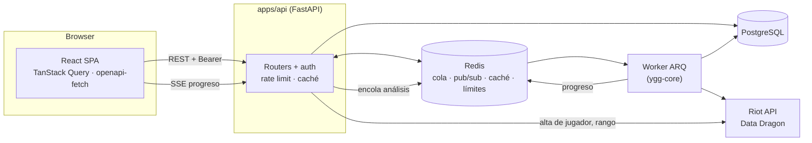
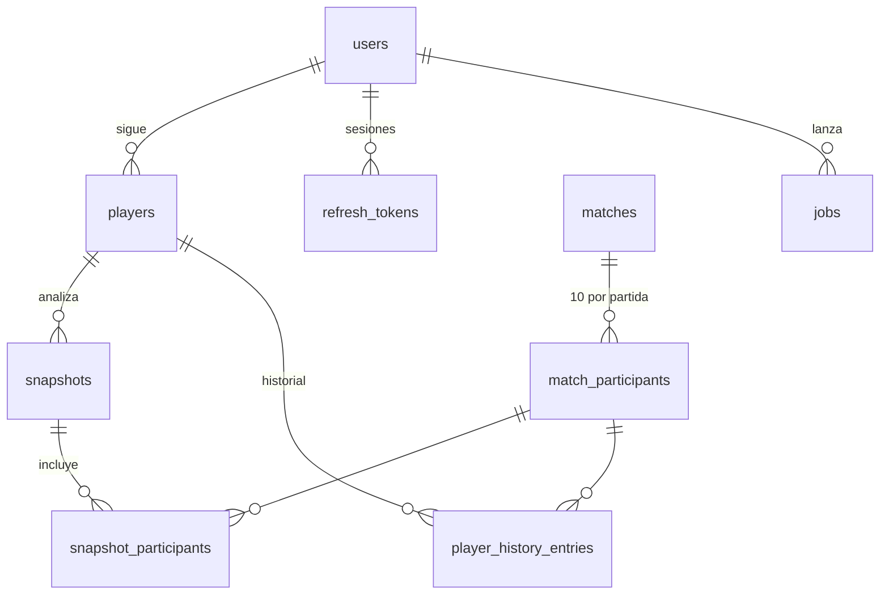

# Arquitectura de YGG

YGG es un monorepo con tres piezas que se despliegan por separado y comparten un motor de análisis.

```
packages/ygg-core   motor de análisis en Python puro (Riot API, timeline, métricas, DuckDB, CLI)
apps/api            API FastAPI + worker ARQ (usa ygg-core)
apps/web            cliente React 19 + TypeScript (tipos generados desde el OpenAPI de la API)
infra               Dockerfiles, docker compose, nginx y configuración de Fly.io
docs                arquitectura, decisiones (adr/), métricas y despliegue
```

## Visión general



## `packages/ygg-core`

Sin FastAPI ni SQLAlchemy; se prueba sin servicios (mypy estricto).

- `riot/`: cliente `aiohttp` con un **limitador global de ventana deslizante** (por segundo y por dos
  minutos) compartido por todas las peticiones, pausa coordinada ante un 429 y parsers tolerantes a
  campos ausentes.
- `timeline/`: enriquecimiento con el timeline (diferencias de oro/CS/XP a los 8, 14 y 25 minutos,
  muertes con coordenadas, visión en objetivos, *Role Quests*).
- `metrics/`: agregados, radar normalizado por rol, estados semánticos (`excellent`/`good`/`normal`/`bad`)
  y tendencias con media móvil.
- `store/duckdb_store.py` y `cli.py`: almacén local y herramienta de línea de comandos (ADR 0003).

## `apps/api`

| Capa | Dónde | Notas |
|---|---|---|
| Entrada | `main.py`, `app/core/middleware.py` | Middlewares ASGI puros: request id, CORS, límite global, modo demo |
| Rutas | `app/routers/` | `response_model` en todas; `openapi.json` versionado y comprobado en CI |
| Auth | `app/auth/` | JWT de 15 min + refresh opaco rotado en cookie httpOnly (ADR 0006) |
| Servicios | `app/service/` | Puente con ygg-core, dashboard y su caché, Data Dragon, cortes de rango |
| Trabajos | `app/jobs/` | Cola ARQ, heartbeat, recuperación de huérfanos, progreso en Redis (ADR 0004 y 0005) |
| Datos | `app/db/`, `app/crud/`, `app/queries/*.sql` | SQLAlchemy 2.0 async, upserts en lote y SQL a mano (ADR 0002) |
| Esquema | `alembic/versions/` | Alembic es el único dueño del esquema |

### Modelo de datos



Una fila de `match_participants` por jugador y partida, única por `(match_id, puuid)` (ADR 0001).

### Flujo de un análisis

1. `POST /snapshots/` valida el dueño del jugador y el límite por usuario. Si ya hay un trabajo activo
   con los mismos parámetros, devuelve ese (índice único parcial); si no, crea la fila en `jobs` y encola.
2. El worker marca `processing`, lanza el heartbeat y llama a `run_stats_extraction`: lista las partidas del
   período, reutiliza las ya guardadas **de ese jugador** y descarga el resto (partida + timeline) con el
   limitador global.
3. Cada avance se publica en Redis. `GET /snapshots/jobs/{id}/stream` lo reenvía por SSE a quien esté mirando.
4. Se hace upsert de partidas y participantes en lote, se crea el snapshot y se invalida la caché de los
   dashboards afectados.
5. Si el worker muere, el cron de recuperación marca el trabajo como interrumpido y el usuario puede reintentarlo.

### Caché y protección

- Dashboard por snapshot en Redis (`dashboard:v2:{id}`), invalidado al cambiar sus partidas o sus notas.
- Datos de Data Dragon en Redis; las imágenes se piden directamente al CDN de Riot.
- Rate limiting con ventana deslizante en Redis: global por IP, login por IP y por email, registro,
  refresh y análisis por usuario. Si Redis cae, se degrada la protección antes que tumbar la API.
- `DEMO_MODE`: API de solo lectura que nunca llama a Riot (ver [`deploy.md`](deploy.md)).

### Observabilidad

Logs estructurados en JSON con `request_id` (structlog), métricas Prometheus en `/metrics`, Sentry
opcional, `/health/live` para el proceso y `/health` con Postgres y Redis (503 si alguno falla).

## `apps/web`

- **Rutas** (React Router, un *chunk* por pantalla): `/login`, `/players`, `/players/:id`,
  `/players/:id/snapshots/:snapshotId`, `/players/:id/snapshots/compare?a=&b=`, `/cutoffs` y
  `/admin/(stats|users|players)`. Pestaña, filtro de campeón y comparación viven en la URL.
- **Datos**: cliente `openapi-fetch` tipado con `src/lib/api/schema.d.ts`, generado desde
  `apps/api/openapi.json` (CI falla si están desalineados). TanStack Query cachea e invalida por claves
  jerárquicas (`src/lib/queryKeys.ts`).
- **Sesión**: access token en memoria, refresh silencioso ante un 401 con una única petición compartida.
- **Gráficas**: radar y tendencias con Recharts; mapa de calor de muertes en SVG propio sobre el minimapa;
  tabla de partidas con TanStack Table y virtualización.
- **Accesibilidad**: foco visible, *skip link*, `aria` en gráficas con tabla alternativa,
  `prefers-reduced-motion` y contraste AA en los tokens de color.

## Entornos

| Entorno | Cómo | Notas |
|---|---|---|
| Local completo | `make up` (docker compose) | Postgres, Redis, API, worker y web en `localhost:5173` |
| Local sin Docker | `uvicorn` con `REDIS_URL=memory://` + `npm run dev` | El trabajo corre en el propio proceso (`InlineJobQueue`) |
| CI | GitHub Actions | ruff, mypy, pytest (core y API con servicios), lint, tests, build, presupuesto y e2e de la web |
| Producción | Vercel + Fly.io + Supabase + Upstash | Ver [`deploy.md`](deploy.md) |
